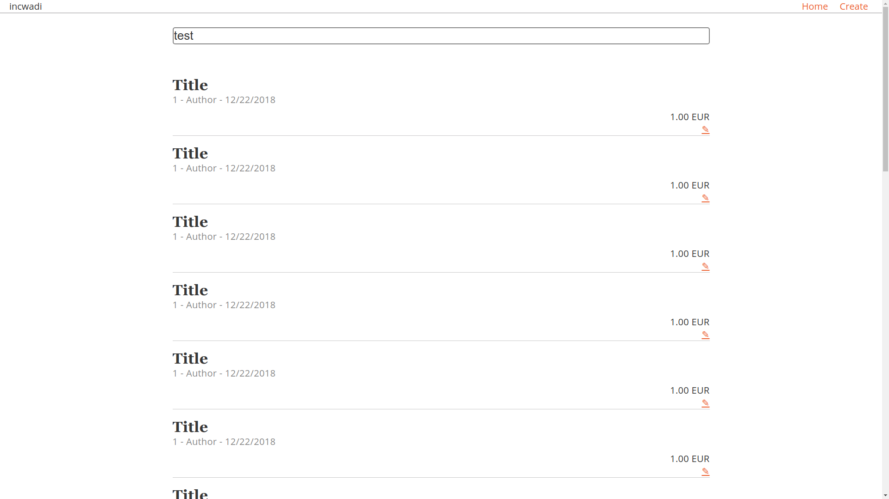

# incwadi

incwadi is a book database to manage your books.



## How it was made

An article can be found here https://medium.com/@A.Baldeweg/i-was-trying-new-things-accf33792e86

## Requirements

- NodeJS 10LTS
- Yarn
- A modern browser

## Getting Started

Download the files from the repository.

```shell
git clone https://gitlab.com/incwadi/inventory.git
```

The `.env` files specify variables. You must define them for production by creating a `.env.production` file.

```shell
touch .env
touch .env.production
```

The files are looking like:

```shell
API=URL
CURRENCY=EUR
BRAND_COLOR=#000000
LOGO=src/assets/logo.png
LOCALE=en
```

Please change the values to your needs. For more informations refer to the section "Options".

Start the build process.

```shell
yarn build
```

The files in `dest/` should be located in your web root.

Configure your webserver to redirect all requests to the `index.html` file.

Example for Apache

```apache
<IfModule mod_rewrite.c>
  RewriteEngine On
  RewriteBase /
  RewriteRule ^index\.html$ - [L]
  RewriteCond %{REQUEST_FILENAME} !-f
  RewriteCond %{REQUEST_FILENAME} !-d
  RewriteRule . /index.html [L]
</IfModule>
```

## Update

Remove the old files and download the new ones like you would install the app.

If you still have the cloned repository and the `.env` files, you can pull for updates and start the build process.

```shell
git pull
yarn build
```

## Options

These options are used in the `.env` files.

- API - Defines the URL to your API.
- CURRENCY - The currency shown in the app.
- BRAND_COLOR - The hex code of your desired color.
- LOGO - Path to your custom logo.
- LOCALE - Choose your language (en, de)

## CLI

- yarn watch - Starts the development environment.
- yarn test - Runs the unit tests.
- yarn build - Builds the app.
